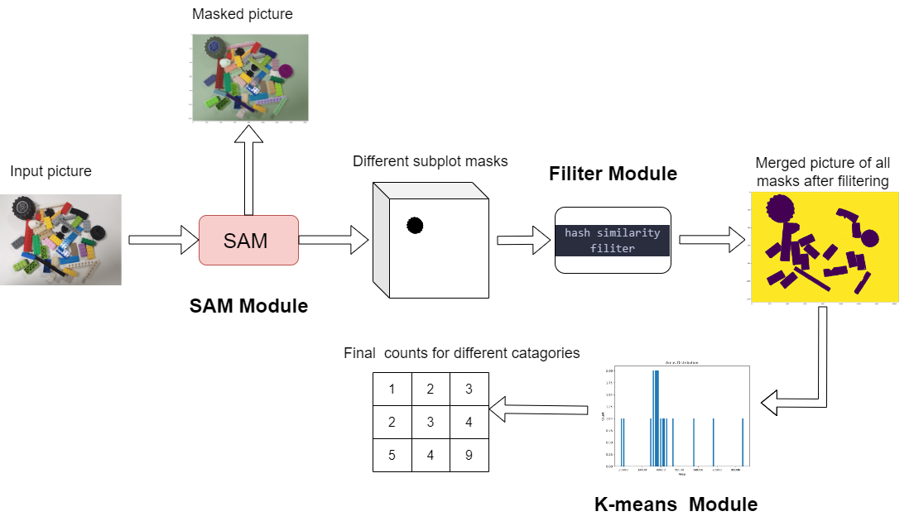

# Overview of My Project


# Conduct of the Code

## Structure 
- All my own codes are in mywork.ipynb
- The segment_anything and scripts come from the project Segment Anything and if you want to explore them more can visit https://github.com/facebookresearch/segment-anything
- sam_vit_h is a checkpoint
- Images include all test picture
- outputpicture include all **rebuild pictures** from all the masks extracted from the original pictures
- 9mask includes all masks from the ninth picture and as I mentioned in the report it is for proving the great segmenting ability of the SAM
- More work includes some code of the "More Advanced Works" in the report

# How to Run
## Environment 
- opencv, pytorch, numpy and so on
- **Other import environment** can refer the Segment website and I also include their README in Segment Readme
- **Notice! This work needs GUP resource** otherwise maybe OOM

**The main part of the code is in the last cell of the mywork.ipynb and you can just run it to see the output** , of courese, allowing the upper parts having been made

## some parameters
#### The SAM
```
#掩码生成器参数修改
mask_generator_2 = SamAutomaticMaskGenerator(
    model=sam,
    points_per_side=20,#控制采样点的间隔，值越小，采样点越密集
    pred_iou_thresh=0.86,#mask的iou阈值
    stability_score_thresh=0.96,#mask的稳定性阈值
    crop_n_layers=1,
    crop_n_points_downscale_factor=2,
    min_mask_region_area=50,  #最小mask面积，会使用opencv滤除掉小面积的区域
)
```

#### The Filiter
```
    #统计汉明距离小于 5 的图像对
    for i in range(n):
        #j从i+1开始，因为相似度矩阵是对称的
        for j in range(i+1,n):
            if hash_matrix[i, j] < 8:#调节这个阈值
                images.pop(j)
                image_areas.pop(j)
                n -= 1
```
#### How many catagories you want
```
clusters = k_means_clustering(areas1,10)#所求类别
print(clusters)
```

Other parts have a lot of Chinese notices and you can explore them

## Thanks 

- Professor Zhao, tutor Chen and the meaningful knowledge in DIP class
- Meta and their fantastic work SAM
